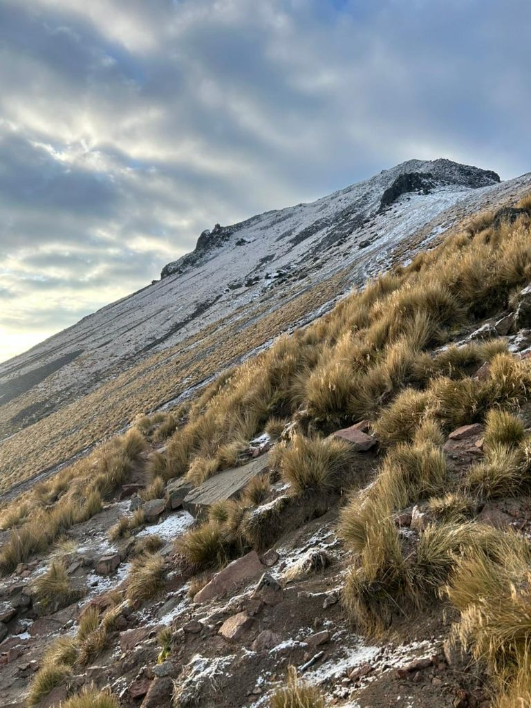
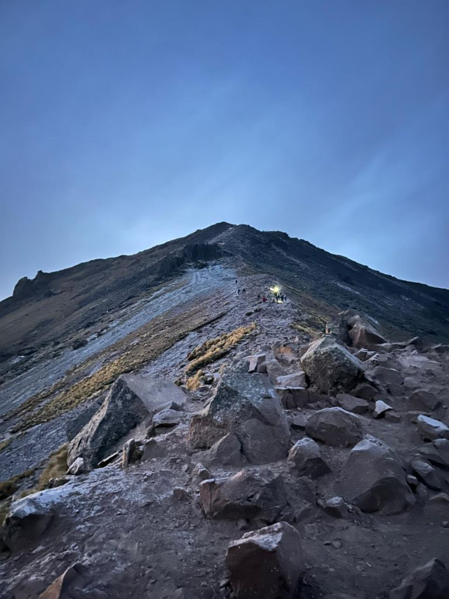
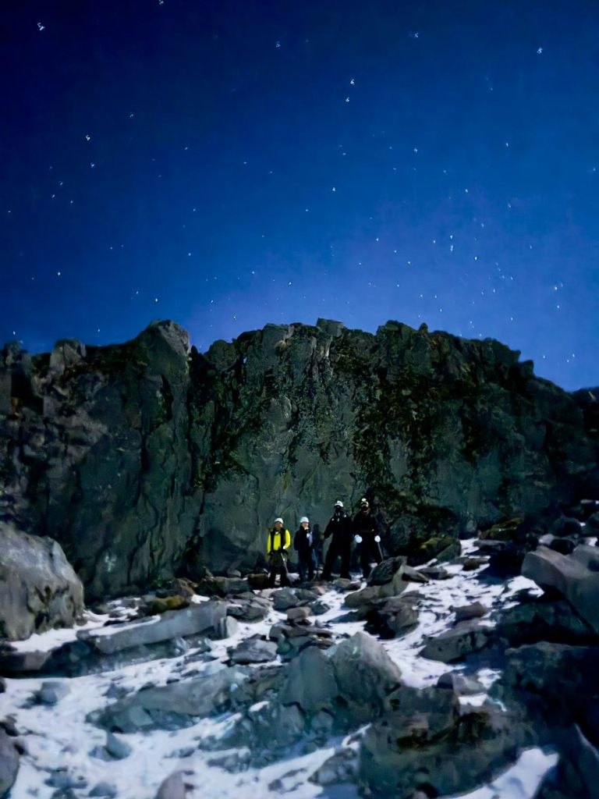

# 🌲 Malintzin Forest Adventure



> **Explora la montaña como nunca antes.** Una plataforma de tours de aventura bilingüe diseñada para ofrecer la mejor experiencia de senderismo en la Malintzin, Tlaxcala.

---

## 🚀 Sobre el Proyecto

**Malintzin Forest** es una Landing Page de alto rendimiento desarrollada por **BIOR Web Studio**. El objetivo es conectar a los entusiastas de la naturaleza con guías locales expertos a través de una interfaz visualmente impactante y funcional.

### ✨ Características Principales
- 🌍 **Soporte Bilingüe:** Sistema dinámico de cambio de idioma (ES/EN) mediante PHP.
- 📱 **Diseño Ultra Responsive:** Experiencia optimizada para móviles, tablets y escritorio.
- 💎 **Interfaz Premium:** Navegación *Glassmorphism* (efecto cristal) y cuadrícula hexagonal personalizada para los tours.
- ⚡ **Optimización SASS:** Estructura modular escalable basada en la metodología BEM.

---

## 🛠️ Stack Tecnológico

| Tecnología | Uso |
| :--- | :--- |
| **PHP** | Lógica del servidor y sistema de traducción dinámico. |
| **SASS** | Estilos modulares, variables de marca y mixins responsivos. |
| **JavaScript (ES6)** | ScrollSpy, animaciones de navegación y filtros dinámicos. |
| **BEM** | Metodología para un CSS limpio y mantenible. |

---

## 📸 Galería Visual

### Cuadrícula de Tours
El corazón de la web utiliza una arquitectura hexagonal para mostrar las rutas más emblemáticas:


*Cima Principal, El Arenal y Bosque de Coníferas.*

### Experiencia Nocturna

*Rutas diseñadas para los más aventureros.*

---

## 📂 Estructura del Repositorio

```text
├── assets/
│   ├── css/      # CSS compilado
│   ├── img/      # Recursos visuales y banners
│   ├── js/       # Módulos de lógica (Nav, Scroll, etc.)
│   └── sass/     # Código fuente modular (Variables, Mixins, Base)
├── includes/     # Componentes reutilizables (Nav, Footer, Header)
├── config.php    # Configuración global
├── languages.php # Diccionario bilingüe (ES/EN)
└── index.php     # Página principal